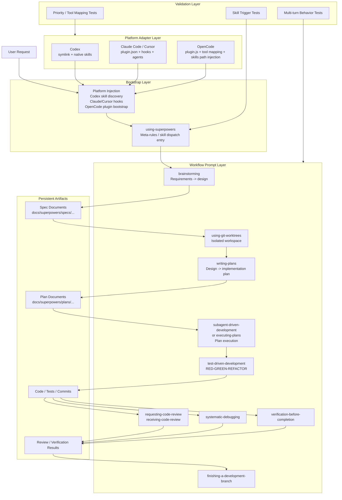

# Superpowers Technical Analysis

## Overview

`superpowers` is best understood as a cross-agent software development workflow system. Its core is not a traditional application runtime, but a library of portable workflow skills expressed as Markdown protocols. Platform-specific code exists, but it is intentionally thin. The repository's main job is to make a shared set of engineering behaviors available to different coding agents such as Codex, Claude Code, Cursor, and OpenCode.

At a high level:

- The product core lives in `skills/`
- Platform-specific integration lives in `.codex/`, `.opencode/`, `.claude-plugin/`, and `.cursor-plugin/`
- Supplemental bootstrap and compatibility logic lives in `hooks/`, `agents/`, and `commands/`
- Behavioral validation lives in `tests/`

The architectural center of gravity is workflow prompting, not platform code.

## Core Thesis

`superpowers` works across major agent platforms because it abstracts at the workflow level rather than at the tool or SDK level.

It does not primarily encode:

- a proprietary execution runtime
- a custom orchestration server
- a platform-specific plugin business logic layer

Instead, it encodes:

- when an agent should switch modes
- what sequence of actions it should follow
- what actions are forbidden at each stage
- what artifacts must be produced
- how the next stage should consume those artifacts

This design gives it strong portability across agent ecosystems with different APIs but similar basic capabilities.

## Repository Structure

### `skills/`

This is the actual product core. Each skill is a self-contained workflow module expressed in a `SKILL.md` file with YAML frontmatter plus structured instructions.

Representative examples:

- `skills/using-superpowers/SKILL.md`
- `skills/brainstorming/SKILL.md`
- `skills/writing-plans/SKILL.md`
- `skills/test-driven-development/SKILL.md`
- `skills/systematic-debugging/SKILL.md`
- `skills/verification-before-completion/SKILL.md`

Each skill typically contains:

- `name`
- `description`
- hard gates and anti-patterns
- required sequence of actions
- required output format or artifact location
- transition guidance to the next skill
- supporting prompt assets, examples, or references

This is a protocol library for agent behavior.

### Platform Integration Directories

#### `.codex/`

Codex integration is intentionally minimal. It relies on Codex native skill discovery. The install process clones the repository and exposes `skills/` through `~/.agents/skills/`.

This means Codex does not need heavy runtime glue. The platform already knows how to discover and load skills; `superpowers` only needs to make those skills visible.

#### `.opencode/`

OpenCode needs a slightly thicker adapter. The plugin in `.opencode/plugins/superpowers.js` does two key things:

- registers the `skills/` directory in OpenCode's live config
- injects the `using-superpowers` bootstrap content into the system prompt

It also performs tool mapping so Claude-oriented skill language can still work in OpenCode.

#### `.claude-plugin/` and `.cursor-plugin/`

These contain plugin metadata used by Claude Code and Cursor. Cursor also references skills, agents, commands, and hooks directly via plugin configuration.

### `hooks/`

The session-start hook is a bootstrap mechanism for Claude Code and Cursor. It injects the content of `using-superpowers` into the session context at startup. This is how the system ensures the agent begins with the meta-rule: always check whether a skill applies before acting.

### `agents/`

This directory contains supplemental role definitions such as `code-reviewer.md`. These are not the main architecture, but they extend the workflow with role-specialized review behavior.

### `commands/`

These appear to be legacy compatibility shims. The current architecture prefers skills over commands. The command files mostly redirect users toward the corresponding skill-based workflow.

### `tests/`

The tests are product-behavior tests, not just implementation tests. They verify:

- whether a skill is discovered
- whether a skill is triggered for natural-language prompts
- whether explicit skill requests work in multi-turn sessions
- whether platform priority rules behave correctly
- whether OpenCode tool mapping and plugin loading are functioning

This is a strong signal that the repository is testing agent behavior as a product surface.

## Architectural Characteristics

### 1. Workflow Assets as the Product Core

The central design decision is that the most important logic is written as portable text protocols in `SKILL.md`, not as platform-specific code.

This has several effects:

- behavior is inspectable and versionable
- logic can be diffed, reviewed, and evolved like source code
- the same workflow can be injected into multiple agent platforms
- platform adapters stay relatively small

### 2. Thin Platform Adapters

Each supported agent only gets enough code to:

- discover skills
- inject bootstrap context
- map tool names where necessary

This is the correct level of coupling for a cross-agent system. The workflow remains portable because the adapters do not try to re-implement business logic.

### 3. File-Based State Transfer

The system does not trust conversational state alone. Skills routinely require durable artifacts such as:

- spec documents in `docs/superpowers/specs/...`
- implementation plans in `docs/superpowers/plans/...`

This is an important architectural decision. Conversation history is unstable across long sessions, truncated contexts, and multi-agent workflows. Files are stable handoff points.

### 4. Explicit Sequencing

Skills do not merely suggest good practices. They encode state transitions. For example:

- `brainstorming` must happen before implementation
- after brainstorming, the next step is `writing-plans`
- execution should occur through `subagent-driven-development` or `executing-plans`
- implementation should follow `test-driven-development`
- completion claims should be blocked by `verification-before-completion`

This makes the skill system behave like a lightweight workflow engine.

### 5. Anti-Rationalization Design

Many skills explicitly address common agent failure modes:

- skipping design for "simple" changes
- writing implementation before tests
- claiming work is complete without verification
- collapsing planning and coding into one step

This is more than documentation style. It is a behavioral control strategy for LLM-based systems.

## Why It Works Across Codex, Claude Code, and OpenCode

The answer is not "because all of them support plugins." The deeper answer is that they all expose a similar minimum capability set:

- some form of system or bootstrap prompt injection
- some form of skill or extension discovery
- some form of file access
- some form of shell or execution access
- some mechanism for tool invocation or role delegation

`superpowers` is designed around that minimum shared capability layer.

### Codex

Codex support is especially clean because Codex already has native skill discovery. `superpowers` only needs to publish its skills into the directory Codex scans.

This is a nearly ideal fit for the repository's architecture because the product is already mostly skill files.

### Claude Code and Cursor

Claude Code and Cursor use plugin metadata and hooks. The session-start hook ensures the agent receives the `using-superpowers` bootstrap content immediately. This gives the system a reliable entry point for its meta-rules.

### OpenCode

OpenCode uses a plugin file to:

- register the superpowers skill directory
- inject the bootstrap skill content
- translate tool references from Claude-oriented vocabulary to OpenCode-native equivalents

This is a good example of the repository's portability strategy. The workflow text stays the same; only the adapter changes.

## Skill Design Pattern

The skill format is a major reason the system is effective.

### Trigger Conditions

Each skill uses `description` not as marketing copy, but as an activation rule. For example:

- use before any creative work
- use when implementing a feature or bugfix
- use when you have an approved spec and need a plan

That makes semantic matching easier for platforms with automatic skill discovery.

### Hard Gates

Skills often include explicit blocks that prohibit jumping ahead. For example, `brainstorming` forbids implementation activity before design approval. This is important because coding agents tend to over-eagerly enter execution mode.

### Ordered Checklists

Skills usually encode a required sequence rather than a loose set of best practices. This reduces agent discretion and improves consistency.

### Anti-Patterns and Rationalization Handling

The TDD skill is particularly strong here. It addresses the exact excuses a model or human might use to skip the intended workflow. This is a deliberate constraint mechanism, not just explanatory writing.

### Output Requirements

Skills usually require some durable output:

- a spec file
- a plan file
- a verification result
- a review result

This turns the workflow into an artifact-producing pipeline rather than a purely conversational loop.

## `using-superpowers` as the Meta-Layer

`using-superpowers` is the architectural keystone.

It defines:

- that skills must be checked before any action
- that even a small chance of relevance is enough to require invocation
- skill priority rules
- process-skill precedence over implementation-skill selection
- the relationship between user instructions and skill instructions

This skill is effectively the dispatch and governance layer for the rest of the system.

Without it, the repository would only be a bag of independent workflows. With it, the repository becomes a coherent agent operating model.

## Behavioral State Machine

A typical happy-path workflow looks like this:

1. `using-superpowers`
2. `brainstorming`
3. `using-git-worktrees`
4. `writing-plans`
5. `subagent-driven-development` or `executing-plans`
6. `test-driven-development`
7. `requesting-code-review`
8. `verification-before-completion`
9. `finishing-a-development-branch`

The important property is not the exact list, but the fact that:

- each stage has a bounded responsibility
- each stage prepares the next stage's inputs
- major transitions are backed by durable files

This is why the system remains stable over long agentic workflows.

## Classification: Prompt Engineering vs Context Engineering vs Harness Engineering

The repository is best classified as prompt engineering, but not in the shallow sense of "a few prompts." It is better described as workflow prompt engineering.

### Why It Is Primarily Prompt Engineering

The most important assets are the skill protocols:

- they determine when a workflow activates
- they determine what the agent must do
- they determine what the agent must not do
- they determine how the agent transitions to the next workflow

This is the dominant layer of value in the repository.

### Why It Is Not Primarily Context Engineering

There is some context engineering in the design:

- specs and plans are written to files
- bootstrap content is injected into sessions
- the system reduces reliance on raw chat history

But these mechanisms support the workflow layer rather than define the product core. The repository is not mainly solving long-context retrieval, summarization, memory compaction, or context routing.

### Why It Is Not Primarily Harness Engineering

There is some harness engineering:

- plugin metadata
- hooks
- OpenCode bootstrap code
- shell-based test harnesses
- platform-specific installation and validation

But that layer is still secondary. It exists to carry the workflow prompts into each platform and verify that they work.

### Final Classification

The most accurate classification is:

`superpowers` is a workflow prompt engineering system supported by light context persistence and light harness adaptation.

## Architecture Diagram

## Design Lessons

If someone wanted to build a similar cross-agent workflow system, the main lessons from `superpowers` would be:

1. Put the core behavior in portable text protocols, not platform-specific code.
2. Make each workflow module narrowly scoped and artifact-driven.
3. Use a bootstrap meta-skill to enforce skill selection discipline.
4. Persist intermediate outputs to files instead of trusting conversation memory.
5. Keep platform adapters thin: discovery, bootstrap, tool mapping.
6. Test user-visible behavior, not just internal implementation details.

## Conclusion

`superpowers` is architecturally significant not because it is code-heavy, but because it identifies the right abstraction boundary for the agent era.

Its durable insight is this:

- APIs vary
- tool names vary
- plugin systems vary
- model behavior drifts

But workflow discipline can still be made portable if it is expressed as:

- discoverable skills
- explicit behavioral protocols
- durable file-based handoffs
- lightweight platform adapters
- behavior-level tests

That is why the repository can support Codex, Claude Code, Cursor, and OpenCode without fragmenting into different products.
